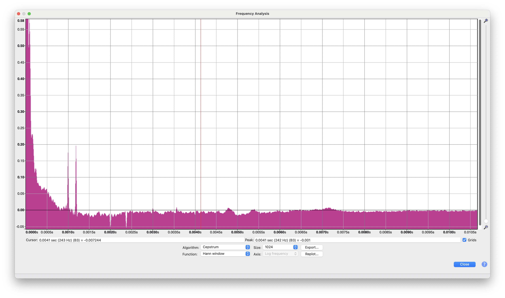
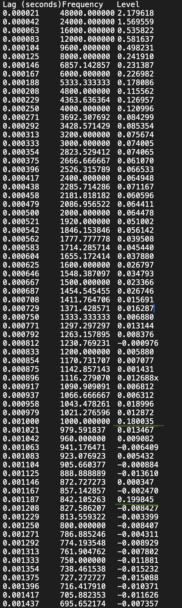
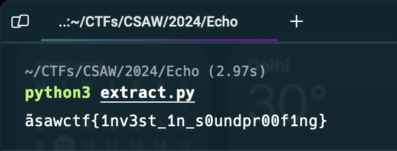

# Is there an Echo?

## Challenge Details

**Description**: Maybe next time you should record your music in an acoustically treated space.

**Category**: Forensics

**Attached Files**: [256.wav](files/256.wav)

## Research

The attached file is a WAV file. On playing it, we can hear a complex composition with guitar strums and a loud bassy voice in the background. As one could guess from the category and the challenge description, the sound file is hiding something in it's echoes. A simple Google Search revealed a lot of papers about Echo Hiding and Steganography in Audio files.

Some sample papers we encountered:
- [Experiments with and Enhancements to Echo Hiding](https://ieeexplore.ieee.org/document/5279373)
- [Echo Hiding](https://link.springer.com/chapter/10.1007/3-540-61996-8_48)

We also found a presentation from [Columbia University](https://www.ee.columbia.edu/~ywang/MSS/Project/Jeff_England_Audio_Steganography.ppt) which explains the concept of Echo Hiding in Audio files. This was by far the easiest way to understand what was really happening.

We learnt that looking at the Cepstrum of the audio file would allow us to see the embedded echoes easily. We googled and found out this could be done easily on a audio forensic old man's favourite tool - Audacity.

We also found a repository with this very particular method of Echo Hiding implemented in MATLAB. The repository can be found [here](https://github.com/ktekeli/audio-steganography-algorithms).

## Analysis

We followed these steps to look at the Cepstrum of the audio file:

1. Open the WAV file in Audacity.
2. Select the entire audio.
3. Go to `Analyze` -> `Plot Spectrum`.
4. In the `Plot Spectrum` window, select `Cepstrum` in the `Algorithm` dropdown.

We can now see the following graph



We can see two peaks of outliers at approx 0.0010 and 0.0012 seconds. These should be the deltas at which the messages are embedded.

To look at the exact deltas, we exported the Cepstrum data to a TXT file and inspected it. We found two entries around those deltas which had levels of 0.18 and 0.19, about 10 times higher than the rest of the data. These are underlined in green in the below screenshot.



The exact deltas were 0.001000 and 0.001187 seconds. To calculate the number of samples by which they are offset, we can multiply them with the sampling rate i.e. 48000 Hz.

`0.001000 * 48000 = 48 samples`
`0.001187 * 48000 = 57 samples`

We can now use these offsets to extract the hidden message from the audio file. The only thing we don't know, however, is the length of the message. From the name of the file, I could guess that it had 256 charachters. But after a lot of trials and failed experiments, I finally found out (a very irritating) relationship:

```python
    data, sample_rate = librosa.load("256.wav", sr=None)
    N = 256
    L = len(data) // N
```

Now, we ere fully equipped to extract the message from the audio file.

## Exploit

We used the repository we had found earlier and translated the code into python. The script can be found [here](files/extract.py).

```python
import numpy as np
import librosa

FILE_PATH = '256.wav'
N = 256
DELAY_1 = 48
DELAY_2 = 57

class EchoDecoder:
    def __init__(self, signal, chunk_size, freq_d0, freq_d1):
        self.signal = signal
        self.chunk_size = chunk_size
        self.freq_d0 = freq_d0
        self.freq_d1 = freq_d1
        self.num_chunks = len(signal) // chunk_size
        self.chunked_signal = self.signal[:self.num_chunks * self.chunk_size].reshape(self.num_chunks, self.chunk_size)

    def _compute_rceps(self, chunk):
        spectrum = np.fft.fft(chunk)
        log_spectrum = np.log(np.abs(spectrum) + 1e-6)
        rceps = np.fft.ifft(log_spectrum).real
        return rceps

    def _decode_chunk(self, chunk):
        rceps = self._compute_rceps(chunk)
        return int(rceps[self.freq_d1] > rceps[self.freq_d0])

    def decode(self):
        binary_data = [str(self._decode_chunk(chunk)) for chunk in self.chunked_signal]
        num_bytes = self.num_chunks // 8
        binary_data_chunks = np.array(binary_data[:8 * num_bytes]).reshape(num_bytes, 8)
        ascii_chars = [chr(int(''.join(bits), 2)) for bits in binary_data_chunks]
        message = ''.join(ascii_chars)
        return message

def main():
    data, sample_rate = librosa.load(FILE_PATH, sr=None)
    L = len(data) // N
    decoder = EchoDecoder(data, L, DELAY_1, DELAY_2)
    decoded_message = decoder.decode()
    print(decoded_message)

if __name__ == "__main__":
    main()


```



## Final Flag

`csawctf{1nv3st_1n_s0undpr00f1ng}`
